Prism is a static-analysis documentation engine for Ansible roles and collections.

It is best understood as a contract-and-governance pipeline, not only a renderer.

## Pipeline Overview

1. discover role/collection structure
2. parse YAML and Jinja signals
3. compute variable insights and scanner counters
4. render docs and machine-readable payloads

## Architecture Overview Diagram

```mermaid
graph TD
    A[User/API Call] --> B[API Layer]
    B --> C[Scanner Core]
    C --> D[DI Container]
    D --> E[Variable Discovery]
    D --> F[Feature Detector]
    D --> G[Output Orchestrator]
    E --> H[Scanner Extract]
    F --> H
    G --> I[Scanner IO]
    H --> J[Scanner Analysis]
    I --> J
    J --> K[Scanner Readme]
    K --> L[Scanner Config]
    L --> M[Final Output]
    M --> N[Rendered Docs]
    M --> O[JSON Payloads]

    style A fill:#e1f5fe
    style B fill:#b3e5fc
    style C fill:#81d4fa
    style D fill:#4fc3f7
    style E fill:#29b6f6
    style F fill:#03a9f4
    style G fill:#039be5
    style H fill:#0288d1
    style I fill:#0277bd
    style J fill:#01579b
    style K fill:#014377
    style L fill:#01354a
    style M fill:#00acc1
    style N fill:#4dd0e1
    style O fill:#80deea
```



## Current Architecture Status

The current architecture has been transformed through the gilfoyle-arch-reform-20260404 plan into a clean, immutable, DI-driven system with functional pipelines, comprehensive observability, and modular testing.

- **Immutability Enforced**: All data flows use immutable TypedDicts and tuples; builders construct complex objects without mutations.
- **DI-Driven Orchestration**: Dependencies injected via explicit DIContainer with lifecycle management and cycle detection.
- **Functional Pipelines**: Core logic decomposed into pure functions composed via strategy patterns; no side effects in pipelines.
- **Observability**: Structured logging with context propagation, metrics collection, and proper error boundaries with recovery.
- **Modular Testing**: Comprehensive test isolation with mocking; parallel execution and 95%+ coverage.
- **Capability Evolution**: Pluggable extensions via registry; strategy patterns for configurable behaviors.

## Architecture Principles

### Immutability

- All data structures are immutable TypedDicts or tuples.
- Builders (e.g., `VariableRowBuilder`, `ScanPayloadBuilder`) construct objects fluently without mutations.
- Runtime checks prevent immutability violations.

### Dependency Injection

- `DIContainer` provides explicit wiring with factory methods.
- No global state; all dependencies passed via parameters or injection.
- Cycle detection prevents import loops.

### Functional Pipelines

- Core logic as pure functions.
- Pipelines composed via function composition and strategy patterns.
- Hotspots optimized with algorithmic improvements.

### Observability

- Structured logging throughout with context propagation.
- Metrics collected for performance and errors.
- Error propagation with full context and recovery strategies.

### Testing

- Unit tests isolated with full mocking; no I/O.
- Parallel execution; 95%+ code coverage.
- Property-based tests for critical functions.

### Evolution Framework

- Extension registry for dynamic loading.
- Strategy patterns for pluggable behaviors.
- Backward compatibility and migration paths.

## Package Naming Standard

Use fully qualified package names when describing ownership or extension targets.

- prefer `prism.api_layer`, not `api_layer`, when the import/package contract is what matters
- prefer `prism.cli_app`, `prism.repo_layer`, and `prism.scanner_core` in architecture docs and tests
- reserve bare directory names such as `api_layer/` for filesystem-oriented discussion only

## Scanner Package Decomposition

`prism.scanner` remains a public facade and delegates canonical runtime behavior to package-owned modules under `src/prism/`:

| Package | Ownership boundary |
| --- | --- |
| `prism.scanner_core` | request normalization, DI-driven orchestration, scan runtime/context assembly, variable discovery orchestration |
| `prism.scanner_data` | typed contracts and builders for request/result envelopes, scan payloads, report metadata, and variable rows |
| `prism.scanner_extract` | YAML/task traversal, variable/reference extraction, role feature collection, requirements and discovery loaders |
| `prism.scanner_readme` | README rendering, style parsing/normalization, documentation insights, section composition |
| `prism.scanner_analysis` | scanner metrics, report shaping, runbook generation, dependency analysis helpers |
| `prism.scanner_io` | output rendering/writing, scan output emission, YAML candidate loading and parse-failure reporting |
| `prism.scanner_config` | policy/config loading, style/section markers, legacy retirement behavior, runtime scan policy switches |
| `prism.scanner_compat` | compatibility bridge helpers isolated from canonical runtime paths |

Cross-package architecture guardrails enforce one-way decomposition: canonical scanner packages must not reverse-import `prism.scanner`, and private cross-package imports are blocked except for explicitly whitelisted seams.

`src/prism/repo_services.py` is the stable shared repo facade. Package-owned repository intake and metadata logic now lives under `prism.repo_layer`, and both `prism.api` and `prism.cli` import the curated facade rather than top-level repo helper modules.

## API And CLI Facades

`prism.api` and `prism.cli` remain the stable top-level public facades.
They should stay small and unsurprising:

- `api.py` owns public API exports and final public-boundary compatibility normalization
- `cli.py` owns the top-level `main()` entrypoint, parser export, and top-level exit handling
- neither facade should own multi-step orchestration or become the default home for new helpers

Concrete internal package names are now frozen and in active use:

| Package | Ownership boundary |
| --- | --- |
| `prism.api_layer` | package-owned API orchestration split across `common.py`, `role.py`, `repo.py`, and `collection.py` |
| `prism.cli_app` | package-owned CLI parser, dispatch, runtime, presenter, and shared helper ownership in `parser.py`, `commands.py`, `runtime.py`, `presenters.py`, and `shared.py` |
| `prism.repo_layer` | package-owned repo clone/workspace orchestration and repo metadata helpers in `intake.py` and `metadata.py` |

Naming rule:

- do not introduce `src/prism/api/` while `src/prism/api.py` remains the stable public module
- do not introduce `src/prism/cli/` while `src/prism/cli.py` remains the stable public module
- internal modules under `prism.api_layer` must not import back through `prism.api`
- internal modules under `prism.cli_app` must not import back through `prism.cli`
- internal modules under `prism.repo_layer` must not import back through `prism.repo_services`

Extension rule:

- add new public API behavior in `prism.api_layer` first, then expose it from `api.py` only if it belongs on the public surface
- add new CLI parser, dispatch, and shared runtime helpers under `prism.cli_app`, not `cli.py`
- keep `cli.py` and `api.py` focused on stable facade seams, compatibility wrappers, and top-level entry handling

Current compatibility note:

- `repo_services.py` remains the shared repo-intake facade used by both `api.py` and `cli.py`
- package-owned repo internals live under `prism.repo_layer`, not as top-level `repo_*` modules
- boundary tests should prefer callable contract and owner-module checks over exact alias identity unless identity is itself the public contract

For a current capability-by-package inventory, see [Package Capabilities](./package-capabilities.md).

Explicit seam register:

- `api.py` should retain only `API_PUBLIC_ENTRYPOINTS`, `API_SHARED_REPO_COMPATIBILITY_SEAMS`, and `API_RETAINED_PATCHABLE_SEAMS`
- `cli.py` should retain only `CLI_PUBLIC_ENTRYPOINTS`, `CLI_SHARED_REPO_COMPATIBILITY_SEAMS`, `CLI_RETAINED_COMPATIBILITY_SEAMS`, and narrowly scoped `CLI_TRANSITIONAL_COMPATIBILITY_SEAMS`
- `repo_services.py` is the canonical shared repo boundary and records that surface via `REPO_SERVICE_CANONICAL_SURFACE` plus `REPO_SERVICE_COMPATIBILITY_SEAMS`

## Typed Seam Contracts

Typed contracts are centralized in `prism.scanner_data` and exposed via
`prism.scanner_data.contracts` and domain split modules
(`contracts_request.py`, `contracts_output.py`, `contracts_report.py`,
`contracts_variables.py`, `contracts_collection.py`, `contracts_errors.py`).

Primary scanner boundaries:

- request/runtime: `ScanOptionsDict`, `ScanContext`, `ScanBaseContext`, `ScanContextPayload`, `FailurePolicyContract`
- output envelopes: `ScanRenderPayload`, `RunScanOutputPayload`, `RunbookSidecarPayload`, `FinalOutputPayload`
- reporting: `ScannerReportMetadata`, `NormalizedScannerReportMetadata`, `ScannerCounters`, `AnnotationQualityCounters`, report row contracts
- public API results: `RoleScanResult`, `CollectionScanResult`, `RepoScanResult`

## Mypy Gate

`tox -e typecheck` runs `mypy` over `src/`. The gate is also wired as a pre-commit hook (`mypy-seams`) and runs in CI on every push/PR via `.github/workflows/prism.yml`.

Flags: `--ignore-missing-imports --disable-error-code=import-untyped --follow-imports=silent`

## Contract And Governance Layers

- contract layer: generated markdown/json defines automation interface behavior
- confidence layer: provenance and uncertainty flags mark non-deterministic areas
- governance layer: CI policies consume scanner flags and JSON fields
- learning loop: `prism-learn` aggregates fleet-wide trends and recommendations

## Design Principle

Prefer deterministic, reviewable output over speculative runtime inference.

## Latest Outstanding Unresolved

From the latest available unresolved provenance report for batch 15 (`overnigh_500-builtins-top20-20260324`):

- unresolved variables: 1,300 of 5,257 total (24.73%)
- top unresolved repositories by count:
  - `ansible-opnsense`: 128 unresolved
  - `AZURE-CIS`: 128 unresolved
  - `bitcoin_core`: 96 unresolved
  - `open_ondemand`: 94 unresolved
  - `rhel6_stig`: 76 unresolved

Built-in variable leakage is still visible in unresolved output, including `ansible_distribution`, `ansible_distribution_major_version`, and `ansible_mounts`.

### Dynamic include_vars Example (Path Unknown At Scan Time)

Concrete report example: in `rhel7_stig`, batch 15 includes:

- `Dynamic include_vars (path unknown at scan time) (1)`
- unresolved variable: `ansible_distribution` (an Ansible gathered fact for OS name, not a role variable expected in `meta/main.yml`)

Representative pattern (matching real RHEL8-CIS style):

```yaml
- name: Include OS specific variables
  tags: always
  ansible.builtin.include_vars:
    file: "{{ ansible_distribution }}.yml"
```

`ansible_distribution` returns the OS name exactly as Ansible reports it — e.g. `RedHat` for Red Hat Enterprise Linux (note: `RedHat` is the correct spelling, matching the Ansible fact value). For a role that declares only `EL` platforms in `meta/main.yml` (as `RHEL8-CIS` does), the complete set of possible `ansible_distribution` values at runtime is bounded and known: `RedHat`, `CentOS`, `Rocky`, `AlmaLinux`, `OracleLinux`. If `vars/RedHat.yml` exists in the role, the scanner *could* statically prove provenance for `ansible_distribution` in this pattern — by cross-referencing the `meta/main.yml` platform list against the vars files present on disk. Currently the scanner treats this as path-unknown at scan time; this is the concrete improvement opportunity for the next lane.

## Implication For Next Lane

Lane A next cycle: implement constrained `include_vars` resolution for roles whose `meta/main.yml` declares a single OS family (e.g. `EL`). When `ansible_distribution` is used as the sole template token in an `include_vars` path, enumerate the bounded set of `ansible_distribution` values for that platform family and check which `vars/<value>.yml` files exist. Mark matched variables as resolved (provenance: `include_vars_platform_constrained`) rather than `unresolved_dynamic_include_vars`. This eliminates false unresolved noise for EL-only roles using the standard `RedHat.yml`/`AlmaLinux.yml` vars-file pattern without masking genuinely missing definitions.
