```mermaid
flowchart TD
    Start([Start / Resume cycle]) --> AlwaysLoad[Always-load globals<br/>guardrails, topology, context-efficiency,<br/>ledger-read, self-improvement]
    AlwaysLoad --> ReadMemory[Read digest.yaml + model-usage-rollup.yaml]
    MemoryStore[(docs/plan/.gilfoyle-lessons)] -. read .-> ReadMemory
    ReadMemory --> Resume{Resuming existing plan?}
    Resume -- No --> NewCycle[Set cycle ID + focus axis]
    Resume -- Yes --> LoadState[Read plan.yaml + findings.yaml]
    LoadState --> PhaseRouter{Resolve current phase<br/>from artifact-backed state}
    PhaseRouter -- ambiguous --> Stall([STALL / recover artifacts,<br/>re-dispatch, repair plan pointer,<br/>repeat current phase])
    Stall --> PhaseRouter

    subgraph P0 [Phase 0 Discovery]
        P0Audit[Write phase-start-audit.yaml]
        P0AuditOK{start audit ok?}
        P0Load[Load phase-0 manifest<br/>sweep prompt + scout patterns]
        P0Graph[Refresh shared architecture/import graph if needed]
        P0Slices[Write graph slices]
        P0Learn[Write learning-context.yaml]
        P0Scouts[Dispatch Scout-Typing / Ownership / ControlFlow / Graph]
        P0Widen{High/Medium or clear seam family?}
        P0WidenRun[Run bounded widening pass]
        P0Barrier[Verify scout artifacts on disk<br/>parse-check outputs<br/>update model ledger/scorecard<br/>emit P0→P1 status]
    end

    NewCycle --> P0Audit
    PhaseRouter -- P0 --> P0Audit
    P0Audit --> P0AuditOK
    P0AuditOK -- No --> Stall
    P0AuditOK -- Yes --> P0Load --> P0Graph --> P0Slices --> P0Learn --> P0Scouts --> P0Widen
    P0Widen -- Yes --> P0WidenRun --> P0Barrier
    P0Widen -- No --> P0Barrier
    P0Barrier -- Fail --> Stall

    DeepReviewGate{Need deep review<br/>or periodic calibration?}
    P0Barrier -- Pass --> DeepReviewGate

    subgraph DR [Deep Review Extension]
        Synth[Synthesizer-Architecture]
        GodCal[Gilfoyle Code Review God Mode<br/>independent calibration pass]
        DeepMerge[Verify net-new findings against live source<br/>promote High/Critical into findings.yaml<br/>write scout-coverage patch if needed]
    end

    DeepReviewGate -- Yes --> Synth --> GodCal --> DeepMerge
    DeepReviewGate -- No --> P1Load
    DeepMerge --> P1Load

    subgraph P1 [Phase 1 Grading]
        P1Load[Load phase-1 manifest<br/>checklist + rubric]
        P1Merge[Foreman grades scout artifacts<br/>into compact shortlist]
        P1Grader{Need independent grader?}
        P1SecondOpinion[Run independent grader]
        P1Suppress[Record suppressed_highs rationale<br/>for any non-promoted high observations]
        P1Artifact[Write compact grading artifact]
        P1OK{grading artifact on disk?}
    end

    PhaseRouter -- P1 --> P1Load
    P1Load --> P1Merge --> P1Grader
    P1Grader -- Yes --> P1SecondOpinion --> P1Suppress
    P1Grader -- No --> P1Suppress
    P1Suppress --> P1Artifact --> P1OK
    P1OK -- No --> Stall

    subgraph P2 [Phase 2 Persist Plan]
        P2Load[Load phase-2 manifest]
        P2Findings[Write or update findings.yaml]
        P2Plan[Write or update plan.yaml<br/>sync resumption_pointer]
        P2Summary[Write phase2 persistence summary]
        P2Next{Any needs_investigation<br/>or unresolved decision?}
    end

    PhaseRouter -- P2 --> P2Load
    P1OK -- Yes --> P2Load
    P2Load --> P2Findings --> P2Plan --> P2Summary --> P2Next

    subgraph P3 [Phase 3 Investigation]
        P3Load[Load phase-3 manifest]
        P3Need{needs_investigation<br/>with conflicting evidence?}
        P3Micro[Dispatch 3-6 named probes<br/>for one finding / one cluster]
        P3Artifacts[Write phase3 investigation artifacts]
        P3Merge[Merge investigation answers]
    end

    PhaseRouter -- P3 --> P3Load
    P2Next -- Yes --> P3Load
    P3Load --> P3Need
    P3Need -- No --> P4Load
    P3Need -- Yes --> P3Micro --> P3Artifacts --> P3Merge --> P4Load

    subgraph P4 [Phase 4 Decide]
        P4Load[Load phase-4 manifest]
        P4Options[Present mutually exclusive options]
        P4Dedup[Dedup + normalize across lanes]
        P4Slice[Create disjoint owned-file waves]
        P4Decision[Record decision in findings.yaml<br/>write phase4 summary]
        P4Disjoint{Owned files disjoint?}
    end

    PhaseRouter -- P4 --> P4Load
    P2Next -- No --> P4Load
    P4Load --> P4Options --> P4Dedup --> P4Slice --> P4Decision --> P4Disjoint
    P4Disjoint -- No --> Stall

    subgraph P5 [Phase 5 Implementation]
        P5Audit[Write wave start-audit.yaml]
        P5AuditOK{wave audit ok?}
        P5Plan[Write wave plan artifact<br/>owned files + dispatch targets]
        P5Builders[Dispatch full disjoint builder batch]
        P5Summaries[Verify one summary artifact per builder]
        P5Narrow[Run narrow gate + anti-pattern grep]
        P5Sync[Sync model ledger + scorecard + plan.yaml]
        P5Barrier{wave barrier pass?}
    end

    PhaseRouter -- P5 --> P5Audit
    P4Disjoint -- Yes --> P5Audit
    P5Audit --> P5AuditOK
    P5AuditOK -- No --> Stall
    P5AuditOK -- Yes --> P5Plan --> P5Builders --> P5Summaries --> P5Narrow --> P5Sync --> P5Barrier
    P5Barrier -- No --> Stall

    subgraph P6 [Phase 6 Validation]
        P6Load[Load phase-6 manifest]
        P6Gatekeeper[Run Gatekeeper full or path-filtered gate]
        P6Auditor{Need Auditor-Regression?}
        P6Regression[Run Auditor-Regression]
        P6Logs[Persist .mutl3y-gate logs and summaries]
        P6Escape{Narrow gate passed<br/>but full gate failed?}
        P6EscapeWrite[Write gate-escape learning candidate]
        P6Verdict{Gate green?}
    end

    PhaseRouter -- P6 --> P6Load
    P5Barrier -- Yes --> P6Load
    P6Load --> P6Gatekeeper --> P6Auditor
    P6Auditor -- Yes --> P6Regression --> P6Logs
    P6Auditor -- No --> P6Logs
    P6Logs --> P6Escape
    P6Escape -- Yes --> P6EscapeWrite --> P6Verdict
    P6Escape -- No --> P6Verdict
    P6Verdict -- No --> P5Audit

    subgraph P7 [Phase 7 Close and Learn]
        P7Load[Load phase-7 manifest]
        P7Close[Close findings with evidence]
        P7Coverage{Deep review or God Mode<br/>missed High/Critical?}
        P7Patch[Write scout-coverage patch]
        P7Candidates[Gather workflow-learning,<br/>coverage, and gate-escape artifacts]
        P7Compile[Run update_learning_memory.py compile<br/>refresh lessons, history, rollup, digest]
        P7Cycle[Record cycle log + focus-axis log<br/>complete closeout bookkeeping]
    end

    PhaseRouter -- P7 --> P7Load
    P6Verdict -- Yes --> P7Load
    P7Load --> P7Close --> P7Coverage
    P7Coverage -- Yes --> P7Patch --> P7Candidates
    P7Coverage -- No --> P7Candidates
    P7Candidates --> P7Compile --> P7Cycle
    P7Compile -. write .-> MemoryStore

    SignoffReady{Required clean thorough passes<br/>already met?}
    P7Cycle --> SignoffReady
    SignoffReady -- No --> NextCycle[Rotate focus axis / start next cycle]
    NextCycle --> Start
    SignoffReady -- Yes --> FinalGodMode[Dispatch Gilfoyle Code Review God Mode<br/>full unconstrained sign-off pass]
    FinalGodMode --> FinalVerdict{Any High/Critical findings?}
    FinalVerdict -- No --> Done([Done / stop iterating])
    FinalVerdict -- Yes --> Promote[Promote High/Critical into findings.yaml<br/>set scout_calibration_required if missed]
    Promote --> Start
```

If your Mermaid preview says "no diagrams detected", open the raw companion file
`workflow-diagram.mmd` with the Mermaid previewer, or open this `.md` file with
the normal Markdown preview.

The diagram content is identical in both files.
